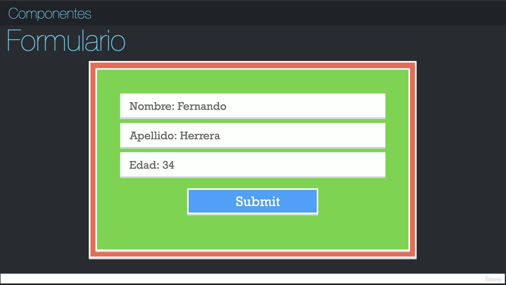

# PRIMEROS PASOS EN REACT

## ¿Qué son los componentes?
Un componente es una pequeña pieza de código encapsulada re-utilizable, que realiza un trabajo en específico, que puede tener estado o no, son como bloques de elementos para tener la aplicación más organizada.

Enfoquemonos ahora en el cuadro verde que va a ser un formulario, cuando es mostrado o renderizado la primera vez, tiene un estado inicial, ese estado inicial es como se encuentra la información de ese componente la primera vez cuando se abre. Ese estado podriamos verlo como que el nombre, apellido y edad no tienen ningún valor, por consiguiente el componente despliega esta información en pantalla.

Pero eventualemente nuestro usuario empieza a escribir, hace modificaciones, y ahora tenemos nuestro formulario ya con valores, cada vez que el usuario toco una tecla y nosotros cambiamos el HTML o mostramos a información en pantalla, eso cambia el estado.

Entonces en pocas palabras, pensemos que el estado es como se encuentra la información del componente en un punto determinado del tiempo.

## Primera aplicación de react
Hay dos formas mediante las cuales nosotros podemos trabajar aplicaciones de react que ya vengan preconfiguradas con todo lo que nosotros vamos a ocupar. Una de ellas es el "Create React App", que fue el que nosotros usamos en la sección anterior para crear la introducción de javascript, la cual es buena porque agiliza mucho la visualización de los archivos en el navegador, y es muy utilizada porque viene ya la configuración de pruebas hecha, variables de entorno, y es bastante util pero trabaja en base a "Webpacks", y no es que sea un problema, pero a diferencia de Webpack, "Vite" utiliza otra forma para hacer los cambios de módulo, lo cual es sorprendentemente más rápido, especialmente cuando el proyecto es más grande, VITE tiende a ser una experiencia de desarrollo super amigable, rápida, eficiente y es años luz de diferencia entre Create React App y Vite.

Para crear el proyecto con Vite:
- `yarn` para independencias locales
- `npm` para independencias globales

En este caso no me funcionó el comando `yarn`, entonces voy a proceder a trabajar con `npm`:

1. `npm create vite` => para comenzar a crear el proyecto
2. `counter-app` => me pide el nombre del proyecto y le doy el que yo considere
3. `react` => me pide que seleccione el framework a utilizar, en este caso react
4. `javascript` => me pide seleccionar una variante, y en este caso escogemos react con javascript
5. `counter-app-vite` => me posiciono en la carpeta del proyecto
6. `npm install` => para instalar las dependencias que se encuentran en ese proyecto
7. Observamos como se crean todas las carpetas y archivos del proyecto en visual studio code, en la capeta 'counter-app-vite'. Todos estos directorios los vamos a explicar en la siguiente clase.

Para crear el proyecto con Create React App:
1. `cd ..` => Nos salimos de la carpeta del proyecto creado con vite
2. `npx create-react-app`+`counter-app` => para comenzar a crear el proyecto
3. Observamos como se crean todas las carpetas y archivos del proyecto en visual studio code, en la carpeta 'counter-app'. Le cambiamos el nombre a 'counter-app-cra'.

## Estructura de directorios - CRA

Estas se conocen como aplicaciones de node porque vemos el 'package-lock.json', vemos el 'package.json', vemos los módulos de node, en pocas palabras esto es una aplicación de node, pero esta configurada de tal manera que nos sirve a nosotros para crear aplicaciones de react, pero con esta misma estructura trabajan tambien otros frameworks y otras librerías.

### Archivo: `package-lock.json`

Este proyecto rapidamente podemos observar que fue creado con npm, porque tenemos el archivo 'package-lock.json', que es un archivo que le dice a nuestra aplicación de node, como fue construida la dependencia de nuestros módulos de node. El 'package-lock.json' es un archivo que nunca debemos tocar manualmente.

### Archivo: `.gitignore`

Es un archivo que la gente de CRA lo pone por nosotros para excluir todos los archivos que no queremos que sean parte de nuestro repositorio, por ejemplo la carpeta '/node_modules' es una carpeta que nosotros nunca vamos a tener que manipular directamente, nunca vamos a realizar un cambio, porque cuando haya algun cambio o alguna actualización en uno de estos paquetes, que son muchos, no todo esto cae en la aplicación de producción, porque estas son dependencias de producción y tambien de desarrollo, el 99% son cosas de desarrollo.

### Archivo: `package.json`

Este archivo tiene mucha información interesante, el nombre de la aplicación, la versión de la aplicación, "private" significa que no es un paquete de npm que nosotros vamos a terminar subiendo, tiene las dependencias de producción, tiene los scripts o comandos que podemos ejecutar rapidamente en este proyecto. estas son algunas cosas importantes:

- `"start": "react-scripts start"` => levanta nuestro servidor de desarrollo para poder desarrollar aplicaciones react
- `"build": "react-scripts build"` => construye la versión de producción de react, y lo deja listo y optimizado para que nosotros podamos tener nuestra aplicación de react y subirla a cualquier lugar
- `"test": "react-scripts test"` => para hacer el resting
- `"eject": "react-scripts eject"` => tener mucho cuidado a la hora de llamar este, porque abre el proyecto y tenemos la posibilidad de hacer configuraciones a webpack y otro monton de cosas, pero una vez que hacemos el eject no podemos volver a como estaba originalmente el proyecto, normalmente esto no hace falta hacerlo a no ser que haya algo muy puntual que necesitemos hacer.

#### Archivo: `README.md`

Muestra lo que nosotros queremos que vean las personas que entran en nuestro repositorio en Github. Todos los archivos que hemos explicado hasta el momento no tienen nada que ver con 'React' sin con 'Node'.

### Carpeta: `node_modules`

Son todas las dependencias de desarrollo y las dependencias que tienen otras dependencias para manejar nuestrom proyecto, nuevamente, casi el 99% de estas dependencias no llegan a la versión de producción, es mas, ahí podemos ver qie aqui está la propia librería de react, pero no vamos a ir nunca a estos directorios a manipularlos directamente.

### Carpeta: `public`

Esta carpeta es muy interesante porque vamos a estar utilizandola mucho a lo largo del curso. El objetivo del CRA es crear un SPA (Single Page Application), que tiene solamente un `index.html`, y toda nuestra aplicación va a acabar siendo montada en el `

`, este root es el mismo que tenemos en la carpeta `src` y el archivo `index.js` con esta línea de código `const root = ReactDOM.createRoot(document.getElementById('root'));`.

- El archivo `favicon.ico` es el logo de React que siempre aparece.

- El archivo `index.html` que tiene ciertos estilos, y que ya viene preconfigurado con un `manifest.json`, que ayuda a que rapidamente tengamos una `PWA` o el punto inicial de una PWA, para saber cual es el icono, cual es el color y muchas cosas mas que trae por defecto, que pude ser que se necesiten o puede ser que no.

- Los archivos `logo192.png` y `logo512.png` son un par de logos de React.

- El archivo `manifest.json` es utilizado para exponer como luce la aplicación cuando se instala en un 'home screen', especificamente en Android, donde esto le saca más provecho. 

- El archivo `robots.txt` que es propiamente para los bots de google, para indexar páginas, entonces aqui le dice cierta información, pero esto no tiene nada que ver con React tampoco, todos estos archivos exceptuando el `index.html` son cosas que hace CRA por nosotros para que no tengamos que configurarlas.

### Carpeta: `source`

Cuenta con un montón de archivos que no necesariamente necesitamos para una aplicación de React:

- Tenemos el archivo `App.css` que es para un estilo global.

- Tenemos el archivo `App.js` el cual ya vamos a comenzar a trabajar en el curso, a veces aparece `App.jsx` y le pone el icono de React, no hay diferencia, js o jsx en cuanto a extensiones es indiferente. Se aconseja que si `
` regresa un elemento jsx que signfica XML + JavaScript, es decir, que el archivo tiene código javascript y código html, que realmente no es HTML y se conoce como JSX, que seria una mezcla entre HTML y Javascript, colocarle la extensión `App.jsx`.

- Tenemos el archivo `App.test.js` que es para el testing que veremos más adelante.

- Tenemos el archivo `index.css` que es otro archivo de estilo global que esta encapsulado, y ya lo veremos más adelante.

- Tenemos el archivo `index.js` que es el punto de entrada de nuestra aplicación, donde esta la importación de React, ReactDom, para montarlo, tenemos la importación del estilo global que es nuestro `index.css`, estamos montando nuestro primer componente `App`, que de este se desprenden todos los demás, y luego tenemos el `reportWebVitals` que esto lo vamos a terminar eliminando porque no es necesario, esto es algo que hace el CRA por nosotros de manera automática. También está el `const root = ReactDOM.createRoot(document.getElementById('root'));` que empieza a crear cual es el nodo 'root' para nuestra aplicación de React, que esta bien que lo trabajemos en modo estricto, porque queremos que no advierta si estamos realizando mal algun tipo de código o estamos haciendo mal algo, se puede manejar de manera 'no estricta', pero no es recomendable.

- Tenemos el archivo `logo.svg` que es el logo de React.

- Tenemos el archivo `reportWebVitals.js` que es la configuración de `reportWebVitals`.

- Tenemos el archivo `setupTests.js` que es algo que vamos a ver más adelante.

## Estructura de directorio - VITE

Aqui vamos a explicar algunas sutiles diferencias que existen con respecto a CRA.

### Archivo: `package.json`

En las dependencias vamos a notar que hay menos dependencias en VITE, porque CRA instala muchas cosas para que nosotros no las tengamos que configurar, a diferencia de VITE que cuando las queramos utilizar las vamos a tener que instalar. Pero algo importante que tiene VITE, es la forma de cambiar modulos en caliente, hace el cambio tan rápido que parece que nunca hizo ningún cambio, porque en el momento en que ustedes tocan cmd+s, ta esta desplegado el cambio sin importar que tan grande sea la aplicación.

- Tenemos el `"dev": "vite"`, que simplemente ejecuta el comando de Vite
- Tenemos el `"build": "vite build"`, que es para construir la aplicación de producción
- Y tenemos otras dependencias ... que no es relevate explicar

### Archivo: `README.md`

No tenemos un archivo de readme en comparación con CRA, por lo tanto si subimos este repositorio a Github, vamos a tener que crar manualmente el archivo README.md y esta bien, lo hacemos de esa manera.

### Archivo: `index.html`

- Tenemos este archivo en la raíz de nuestro proyecto, a diferencia de CRA, que lo teniamos dentro de la carpeta `public`. 
- No tiene puesto por defecto el `manifest.json` dentro del archivo, a diferencia de CRA que si lo tiene, puede que no necesitemos ponerlo en un proyecto o puede que si, entonces en el caso de VITE va a depender de nosotros.
- Tiene tambien el 

- Tiene tambien el modulo inicial que termina siendo reemplasado con otros módulos, pero es interesante como lo maneja VITE, 

### Archivo: `vite.config.js`

- Este archivo no lo tiene CRA, y nos va a servir para hacer configuraciones propias de VITE, que no tienen nada que ver con REACT. Se trata más de una forma que tiene VITE para trabajar, por ejemplo: `plugins: [react()]`, pone a React de manera global en toda la aplicación o en todos sus componentes, y no tenemos que estar importando React en todo lado. 

### Archivo: `yarn.lock`

Este archivo no me aparece a mi porque cree el proyecto con npm, si fue creado con npm, no aparece ningun archivo. Se puede trabajar con cualquiera de los dos, yarn o npm, pero es recomendable no mezclarlos o estar cambiando de metodología porque los archivos `.lock` no van a seguirle el orden, si ustedes quieren cambiar simplemente basta con que ustedes borren el `package-lock.json` o el `yarn.lock`, y simplemente vuelvan a usar 'npm install' o 'yarn install', pero estos archivos no se deben manipular directamente.

### Carpeta: `src`

Tiene algunas diferencias en todos sus archivos, pero todo eso lo vamos a hacer y ver en detalle para que quede muy claro.

NO HAY QUE SER EXPERTO EN ESTE MOMENTO EN TODAS ESTAS DIFERENCIAS, UNICAMENTE ES SABER QUE EXISTEN, TODO SE VA APRENDIENDO EN LA MARCHA.

## Hola Mundo en React

En el archivo `package.json` podemos ver el siguiente comando que es con el que abrimos la aplicación con React:

`"dev": "vite",`

Si es un proyecto de npm ejecutamos éste comando => `npm run dev`

Inmediatamente nos sale lo siguiente:

  VITE v5.2.9  ready in 795 ms

  ➜  Local:   http://localhost:5173/
  ➜  Network: use --host to expose
  ➜  press h + enter to show help

Copiamos la url y la abrimos en el navegador.
Observamos como gira el icono de React, la aplicación es un contador, si damos clic en el botón, vemos como van contando varios números. 

Vamos a seleccionar todo lo de la carpeta `src` y lo vamos a borrar, para hacer todo desde "cero", y observamos que nos tira un error en el navegador, porque el archivo `main` ya no existe.

Y comenzamos:

1. Creamos un archivo `main.jsx` dentro de la carpeta `src`. Cuando veamos un archivo jsx, podemos inferir que hay código React, porque es código xml + código javascript

2. Escribimos el comando `imr` que nos trae `import React from 'react'` que instala la importación de React rapidamente

3. Tambien importamos `import ReactDOM from 'react-dom/client'`, estos dos son los elementos que yo necesito para renderizar mi aplicación

4. Pero, ¿Qué es lo que voy a renderizar, que voy a mostrar?: Usualmente todo en React comienza con un componente o un "funcional component", ese es el punto de entrada de nuestra aplicación, y ese componente no es más que una función. Tambien se trabaja con clases en React, pero las clases ya no son aconsejadas para trabajar en React, son compatibles y se pueden seguir utilizando, pero se acostumbra hoy en día a trabajar con "funcional components", es decir, componentes basados en funciones.

function App() {
    // equivalente a ... document.createElement()
    return <h1>Hola Mundo</h1>;
}

5. Finalmente renderizamos la aplicación con la siguiente instrucción:

ReactDOM.createRoot(document.getElementById('root')).render(
    // se aconseja que siempre que rendericemos lo hagamos en el modo estricto
    <React.StrictMode>
        <App />
    </React.StrictMode>

)

6. Inmediatamente va a aparecer en el navegador la función App() renderizada, asi se trabaja React.

## Para crear los estilos en CSS
Podemos utilizar todo tipo de metodologías para dar estilos, react no es discriminativo con este asunto:

- CSS puro
- Bootstrap
- Tailwind
- Sass

1. Para esto vamos a crear un archivo dentro de la carpeta `src` que se llame `styles.css`.
2. Luego nos vamos a nuestro archivo `main.jsx` y hacemos la importación del archivo `styles.css` para que haga parte de mi aplicación.

## Comunicación entre componentes

En esta clase vamos a hablar sobre un concepto fundamental que son las properties, que los "functional components" reciben, usualmente lo vamos a escuchar como "props", que son las propiedades que le estamos mandando a nuestra función.

## PropTypes

Para trabajar las PropTypes, necesitamos instalarlas en VITE
`npm install prop-types`, en la carpeta del proyecto, en la terminal

## useState - Hook

Esta es de las mejores cosas que React ha incluido en su librería en muchos años, la parte de los Hooks hizo que me gustará mucho trabajar en React.

Los Hooks no son más que funciones.

# PRUEBAS UNITARIAS Y DE INTEGRACION

## Introducción a las pruebas unitarias y de integración

### ¿Qué son las pruebas?

Las pruebas no son una pérdida de tiempo como muchas personas piensan que lo son, hay dos tipos principales de pruebas, las unitarias y las de integración.

### ¿Para qué sirven las pruebas?

#### Pruebas Unitarias
Estan enfocadas en pequeñas funcionalidades de su aplicación, en pequeñas piezas que hay que probar.

`Ejemplo:` Observemos una llanta como si fuera una prueba sencilla, pensemos en esta llanta como un componente aislado que será nuestra prueba unitaria, nosotros vamos a probar que la llanta ande bien, que gire correctamente, que no haya deformaciones, que cuando se abra la caja, salga una llanta y no que sea una pieza que no es una llanta, etc.

Al hacer estas pruebas nosotros podriamos detectar cosas como que la llanta no tiene la resistencia suficiente, hay valores que no funcionan en esta llanta, se destruyó muy rápido, etc.

#### Pruebas de Integración
Estan enfocadas en como reaccionan varias piezas en conjunto.

`Ejemplo:` Una prueba de integración sería que nosotros tomemos cuatro de esas llantas, les montamos la carrocería, les montamos el carro, y ahora vamos a probar las llantas en conjunto con la carrocería, con las ventanas, con el motor, con todas las piezas, y ver si se integran correctamente, si trabajan como yo espero.

### Características

- Fáciles de escribir
- Fáciles de leer
- Confiables
- Rápidas
- Principalmente unitarias

Usualmente vamos a empezar de pequeñas partes, si nosotros tenemos todas las piezas pequeñas probadas, hacer una prueba de integración debería de confirmar la interacción entre si, y no realizar pruebas unitarias dentro de nuestras pruebas de integración, porque todas esas pequeñas piezas ya fueron probadas, solo queremos enfocarnos en que trabajen bien entre si.

Estos pasos se aplican y son conocidos como `AAA`, que son caracteristicas que nosotros siempre deberiamos incluir en nuestras pruebas:

#### 1. Arrange (Arreglar)
Es el paso en el que nosotros establecemos el estado inicial, usualmente se conoce como el sujeto a probar:

- Inicializamos variables
- Hacemos importaciones necesarias
- Y en general preparamos el ambiente a probar

#### 2. Act (Actuar)
Es el paso dónde nosotros vamos a aplicar acciones o estímulos al sujeto de pruebas, o en pocas palabras el paso anterior:

- Llamamos métodos
- Simulamos clicks
- Y realizamos acciones sobre el paso anterior, la idea es que aplicamos el estímulo al sujeto de pruebas, para preparar el siguiente paso

#### 3. Assert (Afirmar)
Este paso se resume a observar el comportamiento resultante:
- Si son los resultados esperados
- Ej: Que algo cambie, que algo incremente o bien que nada suceda

### Mitos

#### Hacen que mi aplicación no tenga errores
Esto no es cierto porque las pruebas como el mismo programa, pueden ser escritos por el mismo programador o por otros programadores, pero de todos modos son humanos, y se pueden equivocar.

#### Las pruebas no pueden fallar
Esto tampoco es cierto, porque nosotros podemos hacer pruebas que arrojen falsos positivos o falsos negativos, puede que algo funcione pero la prueba no funcionó, o puede que la prueba funcione pero el programa no funcionó.

#### Hacen más lenta mi aplicación
Esto no es cierto porque la parte de las pruebas corre directamente en la máquina de desarrollo, estas pruebas no llegan a la parte de producción, no es parte del bundle que nosotros vamos a generar para desplegarlo en un servidor. Las pruebas son locales y se ejecutan en la máquina de desarrollo o en la máquina donde estamos creando nuestra aplicación.

#### Es una pérdida de tiempo
Y en parte si lo es, pero si nosotros hacemos pruebas de cosas que no tienen sentido probar, por ejemplo, si nosotros vamos a usar una librería X en nuestra aplicación, no deberiamos probar la librería, posiblemente quien creo esa librería hizo las pruebas respectivas y es él quien tiene que hacer esas pruebas, nosotros no vamos a probar si una librería o un paquete que importamos en nuestra aplicación funcione. Nosotros lo que probariamos es que las interacciones con esa librería, sea lo que sea que haga, reaccione y trabaje como nosotros esperamos en nuestra aplicación.

#### Hay que probar todo
Y esto puede ser cierto, o puede que no, si nosotros nos ponemos a probar todo, facilmente puede tomar el mismo tiempo o inclusive más que el tiempo que nos tomó crear nuestra aplicación, porque las pruebas nosotros las vamos a programar, no es algo de todo automatico. Una vez que creamos la prueba, pues la ejecutamos si si esta última si es una tarea automática, pero tendriamos que crearla.

Mi recomendación es, si ustedes tienen un deadline o una fecha de entrega cercana, prueben la ruta crítica de su aplicación, prueben las características principales de la misma, y si tienen tiempo pueden probar otras características adicionales que puede ser que fallen. Hay que ser eficientes en la parte de las pruebas

TODO LO MENCIONADO EN ESTA PRESENTACION SE APLICA A PRUEBAS EN CUALQUIER LENGUAJE Y EN CUALQUIER FRAMEWORK.

## Mi primera prueba y configuraciones iniciales

Para este ejercicio, incluimos en nuestro proyecto en la carpeta `src` de `counter-app-vite` la carpeta externa `base-pruebas`, dónde se encuentran todos los ejercicios que hicimos en la primera sección de javascript de este curso.

Tambien debemos hacer ciertas configuraciones al estar trabajando con VITE.
1. Vamos al sitio web `https://jestjs.io/`, que es un framework que sirve para hacer pruebas en aplicaciones de javascript principalmente. Nosotros vamos a estar trabajando con `Jest` y `React Testing Library` de forma complementaria, y este último lo estaremos instalando más adelante.
2. Vamos a la documentación en la sección `Getting Started` y copiamos el comando de npm
3. `npm install --save-dev jest` => lo ejecutamos en la terminal, e instalamos
4. Vamos a nuestro archivo `package.json` y verificamos la dependencia `"jest": "^29.7.0",`
5. Dentro del `package.sjon` tambien debemos crear el script del test, que lo copiamos de la documentación, en la misma sección de `getting started`

{
  "scripts": {
    "test": "jest"
  }
}

6. Despues de crear el script, corremos el comando en otra terminal `npm run test`, para eso abrimos una nueva pestaña en la terminal externa a VSC
7. Inmediatamente nos dice que no encontró ninguna prueba "No tests found, exiting with code 1", y eso es porque aún no hemos creado ninguna prueba
8. Para crear nuestra primera prueba, creamos una nueva carpeta `tests` donde tendremos un espejo de cada uno de los archivo de la carpeta source
9. Creo mi primer archivo dentro de la carpeta `tests` => `demo.test.js`
10. Ejecuto nuevamente mi comando de pruebas `npm run test`, y me saca otro error, "Your test suite must contain at least one test", que dice que al menos el archivo debe tener una prueba
11. Entonces creamos la prueba dentro del archivo y volvemos a correr `npm run test`
12. Para no estar corriendo todo el tiempo el comando, vamos a nuestro archivo `package.json` y configuramos para que se corra automaticamente cuando guardemos en nuestro proyecto `"test": "jest --watchAll"`
13. Al tener esto configurado y con la función de VSC de autoguardado, cada vez que hagamos un cambio en la prueba, vermos en la terminal la ejecución de la prueba, si colocamos en la misma pantalla del VSC, la terminal de mac reducida a un costado, es fenomenal para trabajar

## Jest - Expect - toBe

1. Vamos a instalar una dependecia más para que me ayude a no tener que memorizar como se escriben cada uno de los métodos del `expect` => `npm add -D @types/jest`
2. Confirmar una vez se abra el VSC la proxima vez, si actualiza el completado de los métodos 

## Pruebas en el archivo 02-template-string.js

1. Creamos la carpeta espejo de `base-pruebas` en nuestra carpeta `tests`
2. Creamos el archivo espejo `02-template-string.test.js` en la carpeta `base-pruebas` de nuestra carpeta `tests`
3. E inmediatamente me corre la prueba de forma automática, pero me corre para los dos archivos, si  tuvieramos 100 archivos, me mostaría demasiada información, entonces para eso hacemos lo siguiente.
4. Presionamos la techa `w` y luego presionamos la tecla `p`
5. En pattern > escribimos la primera parte del nombre del archivo para el cual queremos correr la prueba, que lo identifique de manera única, por ejemplo  `02-template`, y presionamos la tecla `Enter`
6. Escribimos entonces la prueba en nuestro archivo, pero nos sale otro error "Jest encountered an unexpected token", y es porque aún nos falta otra configuración
7. Vamos entonces a instalar una dependencia que aún nos faltaba `npm install --save-dev babel-jest @babel/core @babel/preset-env`
8. Tambien nos pide que creemos el archivo `babel.config.js`
9. Le colocamos al archivo esta información:

module.exports = {
  presets: [['@babel/preset-env', {targets: {node: 'current'}}]],
};
10. Nos salimos con `control+c` y volvemos a correr la prueba con `npm run test`
11. Observamos un error que dice "You appear to be using a native ECMAScript module configuration file, which is only supported when running Babel asynchronously"
12. La solución para este error es "Cambiar extensión del archivo `babel.config.js` a `.cjs`"
13. Inmediatamente la prueba corre con normalidad

## toEqual

1. Vamos a pasar al archivo `05-funciones.js`
2. Abrimos el archivo y dejamos únicamente el código que realmente nos interesa
3. Creamos el archivo espejo `05-funciones.test.js` en la carpeta espejo `base-pruebas` ubicada en la carpeta `tests`
4. Escribimos la prueba en el archivo creado
5. Antes de completar toda la prueba, él se encuentra ejecutando en la terminal el archivo anterior, entonces tecla `w`, tecla `p`, nombre del archivo `05-funciones`

## Pruebas con async-await

1. Puede que para versiones antiguas de node la prueba nos saque un error, pero versiones recientes, que ya vienen con el 'fetch' no tendriamos ese problema. Para resover ese problema tendriamos que crear el archivo `jest.config.cjs` y hacer una configuración. Este archivo lo va a buscar tan pronto ustedes lancen el 'test suite'.

2. Escribimos en este archivo el siguiente código:
module.exports = {
    // TODO: jsdom,
    setupFiles: ['./jest.setup.js']
}

3. Después creamos el archivo `jest.setup.js`
4. Instalamos el paquete de fetch => `npm add -D whatwg-fetch`, que es solo de desarrollo, no lo vamos a usar en producción para nada
5. Y llamamos el paquete instalado desde el nuevo archivo.
`import 'whatwg-fetch';`, y las pruebas que hagamos deberían de pasar sin problemas

## Pruebas sobre componentes de React

Nosotros tenemos que pensar en qué es lo que queremos evaluar en la aplicación
1. Que mi título esté dentro de un header (h1)
2. Qué el subtítulo esté dentro de un parrafo (p)
3. Que el nombre esté en un parrafo (p)
4. Que los valores por defecto sean determinados valores
5. Que obligue al usuario a enviar siempre el título
lo que si no tiene sentido evaluar, son los comentarios ...
6. Tambien, si nuestra aplicación tiene botones, podemos probar que pasa si hago clic en ellos

La idea es que probemos todas las posibilidades, para asegurar que nuestro componente trabaje el día de mañana de la manera esperada. Por ejemplo, que pasaría si yo le mando un título, pero ese título no aparece en el html (h1)?, es decir, no se renderiza, ese puede ser un problema bastante serio, imaginese que sea el logo de la empresa, o el nombre de la compañía, o el nombre del usuario, eso es algo que tiene que estar ahí siempre, y tengo que asegurarme que mis componentes el día de mañana trabajen como yo espero que trabajen.

LAS PRUEBAS SE PUEDEN ACTUALIZAR EN CUALQUIER MOMENTO

Trabajar las pruebas con `jest` es muy bueno porque es muy fuerte en el código que nosotros escribimos en nuestras pruebas como `expect`, `toBe`, `toEqual`, etc. Pero para la parte que 'jest' no es tan bueno es para hacer pruebas con componentes propios de React, especialmente con las últimas versiones de React, especialmente con las últimas versiones de React, después de la 18, que hubo cambios fuertes en la forma como se estructura internamente, entonces eso es un poco más dificil de evaluar. 

La otra opción es `https://testing-library.com/`, cómo vamos a trabajar con los dos entonces?
Vamos a usar `jest` para que nosotros podamos hacer nuestras evaluaciones, usar el `expect`, el `toBe`, y todo lo que hemos visto hasta el momento.

Y vamos a usar también `React-testing-library` porque es muy bueno para manejar el DOM, para manejar el DOM virtual, es como si nosotros tuvieramos todo nuestro componente montado en memoria, y poder hacer evaluaciones y aserciones con él. Con la manipulación de el DOM, que en realidad no está haciendo manipulación del DOM, porque es algo virtual que está adentro de nuestra consola, nosotros vamos a poder saber y hacer manipulaciones de clics, vamos a poder hacer todo lo que nosotros haríamos de forma manual, ya que será `React-testing-library` quien hará los clic a los botonones, y nosotros haremos aserciones según lo que sucede después.

`React-testing-library` es una librería que está más enfocada en lo que sucede en la pantalla, en lo que sucede después de hacer las interacciones, y `jest` está más orientada a hacer las aserciones y también a hacer ciertos mocks de funciones que yo necesito evaluar, por ejemplo, si ustedes quieren evaluar de que algo llegó al backend, ustedes perfectamente se crean una función ficticia, la cual va a poder controlar los panoramas de si salen bien, si sale mal.

1. Vamos a la página `https://jestjs.io/`
2. Clic en `Docs`
3. Vamos a la sección `Framework Guides`, `Testing React Apps`
4. Bajamos a la parte `DOM testing`, y observamos que ellos mismos recomiendan que usemos `React-testing-library`
5. Ejecuto el comando de intslación => `npm install --save-dev @testing-library/react`

Si vamos a la página de `jest` también está la instrucción:
1. Vamos a la página `https://testing-library.com/`
2. Clic en `Get Started`
3. Vamos a la sección de `Frameworks`, `React Testing Library`, `Introduction`
4. Ejecuto el comando de instalación => `npm install --save-dev @testing-library/react`

## Pruebas en FirstApp - Componentes de React

Al ejecutar la primera prueba nos sale un error de configuración "If you want to leave it as-is, add @babel/plugin-syntax-jsx (https://github.com/babel/babel/tree/main/packages/babel-plugin-syntax-jsx) to the 'plugins' section to enable parsing."

Entonces vamos a hacer una pequeña configuración adicional:

1. Vamos en VSC al archivo `jest.config.cjs` y agregamos `testEnvironment: 'jest-environment-jsdom',`
2. Instalamos una nueva dependencia de desarrollo `npm add -D jest-environment-jsdom`

Al tratar de probar, no sale un error más "Jest encountered an unexpected token", para lo cual hacemos la siguiente configuración:
1. Vamos en VSC al archivo `babel.config.cjs`
2. Modificamos el archivo para que quede de esta manera:

module.exports = {
    presets: [
        [ '@babel/preset-env', { targets: { esmodules: true } } ],
        [ '@babel/preset-react', { runtime: 'automatic' } ],
    ],
};

3. Finalmente hacemos una instalación más que hace falta `npm add -D @babel/preset-react`
4. Si nos sigue saliendo error, cancelamos la prueba, y volvemos a correr la prueba => `npm run test`

AHORA SI PODEMOS COMENZAR NUESTRA PRUEBA!

