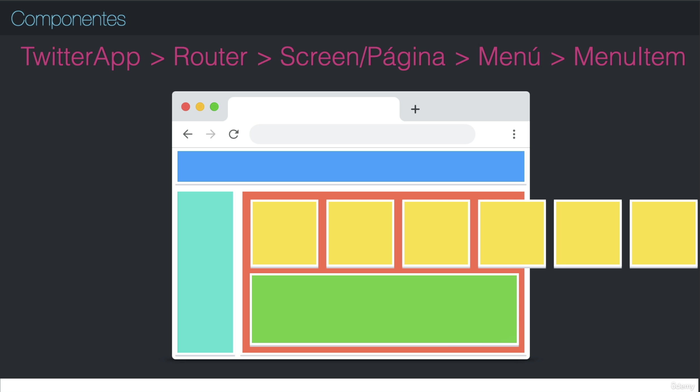
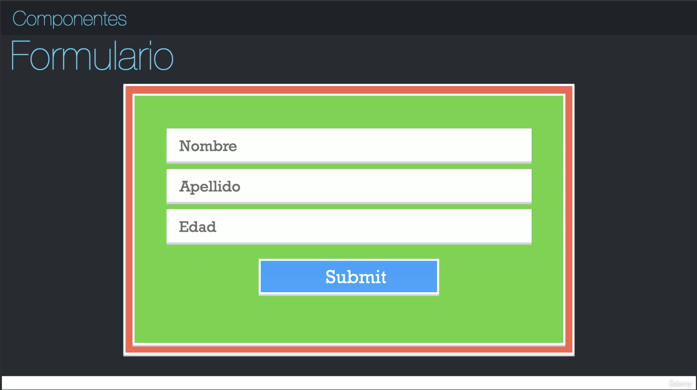
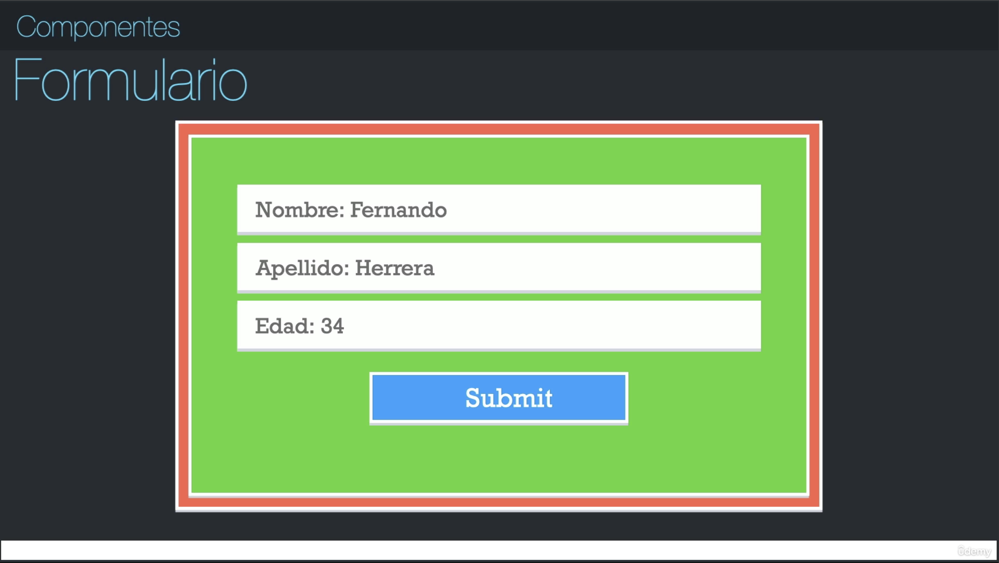

# PRIMEROS PASOS EN REACT

## ¿Qué son los componentes?
Un componente es una pequeña pieza de código encapsulada re-utilizable, que realiza un trabajo en específico, que puede tener estado o no, son como bloques de elementos para tener la aplicación más organizada.

Enfoquemonos ahora en el cuadro verde que va a ser un formulario, cuando es mostrado o renderizado la primera vez, tiene un estado inicial, ese estado inicial es como se encuentra la información de ese componente la primera vez cuando se abre. Ese estado podriamos verlo como que el nombre, apellido y edad no tienen ningún valor, por consiguiente el componente despliega esta información en pantalla.

Pero eventualemente nuestro usuario empieza a escribir, hace modificaciones, y ahora tenemos nuestro formulario ya con valores, cada vez que el usuario toco una tecla y nosotros cambiamos el HTML o mostramos a información en pantalla, eso cambia el estado.

Entonces en pocas palabras, pensemos que el estado es como se encuentra la información del componente en un punto determinado del tiempo.

## Primera aplicación de react
Hay dos formas mediante las cuales nosotros podemos trabajar aplicaciones de react que ya vengan preconfiguradas con todo lo que nosotros vamos a ocupar. Una de ellas es el "Create React App", que fue el que nosotros usamos en la sección anterior para crear la introducción de javascript, la cual es buena porque agiliza mucho la visualización de los archivos en el navegador, y es muy utilizada porque viene ya la configuración de pruebas hecha, variables de entorno, y es bastante util pero trabaja en base a "Webpacks", y no es que sea un problema, pero a diferencia de Webpack, "Vite" utiliza otra forma para hacer los cambios de módulo, lo cual es sorprendentemente más rápido, especialmente cuando el proyecto es más grande, VITE tiende a ser una experiencia de desarrollo super amigable, rápida, eficiente y es años luz de diferencia entre Create React App y Vite.

Para crear el proyecto con Vite:
- `yarn` para independencias locales
- `npm` para independencias globales

En este caso no me funcionó el comando `yarn`, entonces voy a proceder a trabajar con `npm`:

1. `npm create vite` => para comenzar a crear el proyecto
2. `counter-app` => me pide el nombre del proyecto y le doy el que yo considere
3. `react` => me pide que seleccione el framework a utilizar, en este caso react
4. `javascript` => me pide seleccionar una variante, y en este caso escogemos react con javascript
5. `counter-app-vite` => me posiciono en la carpeta del proyecto
6. `npm install` => para instalar las dependencias que se encuentran en ese proyecto
7. Observamos como se crean todas las carpetas y archivos del proyecto en visual studio code, en la capeta 'counter-app-vite'. Todos estos directorios los vamos a explicar en la siguiente clase.

Para crear el proyecto con Create React App:
1. `cd ..` => Nos salimos de la carpeta del proyecto creado con vite
2. `npx create-react-app`+`counter-app` => para comenzar a crear el proyecto
3. Observamos como se crean todas las carpetas y archivos del proyecto en visual studio code, en la carpeta 'counter-app'. Le cambiamos el nombre a 'counter-app-cra'.

## Estructura de directorios - CRA

Estas se conocen como aplicaciones de node porque vemos el 'package-lock.json', vemos el 'package.json', vemos los módulos de node, en pocas palabras esto es una aplicación de node, pero esta configurada de tal manera que nos sirve a nosotros para crear aplicaciones de react, pero con esta misma estructura trabajan tambien otros frameworks y otras librerías.

### Archivo: `package-lock.json`

Este proyecto rapidamente podemos observar que fue creado con npm, porque tenemos el archivo 'package-lock.json', que es un archivo que le dice a nuestra aplicación de node, como fue construida la dependencia de nuestros módulos de node. El 'package-lock.json' es un archivo que nunca debemos tocar manualmente.

### Archivo: `.gitignore`

Es un archivo que la gente de CRA lo pone por nosotros para excluir todos los archivos que no queremos que sean parte de nuestro repositorio, por ejemplo la carpeta '/node_modules' es una carpeta que nosotros nunca vamos a tener que manipular directamente, nunca vamos a realizar un cambio, porque cuando haya algun cambio o alguna actualización en uno de estos paquetes, que son muchos, no todo esto cae en la aplicación de producción, porque estas son dependencias de producción y tambien de desarrollo, el 99% son cosas de desarrollo.

### Archivo: `package.json`

Este archivo tiene mucha información interesante, el nombre de la aplicación, la versión de la aplicación, "private" significa que no es un paquete de npm que nosotros vamos a terminar subiendo, tiene las dependencias de producción, tiene los scripts o comandos que podemos ejecutar rapidamente en este proyecto. estas son algunas cosas importantes:

- `"start": "react-scripts start"` => levanta nuestro servidor de desarrollo para poder desarrollar aplicaciones react
- `"build": "react-scripts build"` => construye la versión de producción de react, y lo deja listo y optimizado para que nosotros podamos tener nuestra aplicación de react y subirla a cualquier lugar
- `"test": "react-scripts test"` => para hacer el resting
- `"eject": "react-scripts eject"` => tener mucho cuidado a la hora de llamar este, porque abre el proyecto y tenemos la posibilidad de hacer configuraciones a webpack y otro monton de cosas, pero una vez que hacemos el eject no podemos volver a como estaba originalmente el proyecto, normalmente esto no hace falta hacerlo a no ser que haya algo muy puntual que necesitemos hacer.

#### Archivo: `README.md`

Muestra lo que nosotros queremos que vean las personas que entran en nuestro repositorio en Github. Todos los archivos que hemos explicado hasta el momento no tienen nada que ver con 'React' sin con 'Node'.

### Carpeta: `node_modules`

Son todas las dependencias de desarrollo y las dependencias que tienen otras dependencias para manejar nuestrom proyecto, nuevamente, casi el 99% de estas dependencias no llegan a la versión de producción, es mas, ahí podemos ver qie aqui está la propia librería de react, pero no vamos a ir nunca a estos directorios a manipularlos directamente.

### Carpeta: `public`

Esta carpeta es muy interesante porque vamos a estar utilizandola mucho a lo largo del curso. El objetivo del CRA es crear un SPA (Single Page Application), que tiene solamente un `index.html`, y toda nuestra aplicación va a acabar siendo montada en el `

`, este root es el mismo que tenemos en la carpeta `src` y el archivo `index.js` con esta línea de código `const root = ReactDOM.createRoot(document.getElementById('root'));`.

- El archivo `favicon.ico` es el logo de React que siempre aparece.

- El archivo `index.html` que tiene ciertos estilos, y que ya viene preconfigurado con un `manifest.json`, que ayuda a que rapidamente tengamos una `PWA` o el punto inicial de una PWA, para saber cual es el icono, cual es el color y muchas cosas mas que trae por defecto, que pude ser que se necesiten o puede ser que no.

- Los archivos `logo192.png` y `logo512.png` son un par de logos de React.

- El archivo `manifest.json` es utilizado para exponer como luce la aplicación cuando se instala en un 'home screen', especificamente en Android, donde esto le saca más provecho. 

- El archivo `robots.txt` que es propiamente para los bots de google, para indexar páginas, entonces aqui le dice cierta información, pero esto no tiene nada que ver con React tampoco, todos estos archivos exceptuando el `index.html` son cosas que hace CRA por nosotros para que no tengamos que configurarlas.

### Carpeta: `source`

Cuenta con un montón de archivos que no necesariamente necesitamos para una aplicación de React:

- Tenemos el archivo `App.css` que es para un estilo global.

- Tenemos el archivo `App.js` el cual ya vamos a comenzar a trabajar en el curso, a veces aparece `App.jsx` y le pone el icono de React, no hay diferencia, js o jsx en cuanto a extensiones es indiferente. Se aconseja que si `
` regresa un elemento jsx que signfica XML + JavaScript, es decir, que el archivo tiene código javascript y código html, que realmente no es HTML y se conoce como JSX, que seria una mezcla entre HTML y Javascript, colocarle la extensión `App.jsx`.

- Tenemos el archivo `App.test.js` que es para el testing que veremos más adelante.

- Tenemos el archivo `index.css` que es otro archivo de estilo global que esta encapsulado, y ya lo veremos más adelante.

- Tenemos el archivo `index.js` que es el punto de entrada de nuestra aplicación, donde esta la importación de React, ReactDom, para montarlo, tenemos la importación del estilo global que es nuestro `index.css`, estamos montando nuestro primer componente `App`, que de este se desprenden todos los demás, y luego tenemos el `reportWebVitals` que esto lo vamos a terminar eliminando porque no es necesario, esto es algo que hace el CRA por nosotros de manera automática. También está el `const root = ReactDOM.createRoot(document.getElementById('root'));` que empieza a crear cual es el nodo 'root' para nuestra aplicación de React, que esta bien que lo trabajemos en modo estricto, porque queremos que no advierta si estamos realizando mal algun tipo de código o estamos haciendo mal algo, se puede manejar de manera 'no estricta', pero no es recomendable.

- Tenemos el archivo `logo.svg` que es el logo de React.

- Tenemos el archivo `reportWebVitals.js` que es la configuración de `reportWebVitals`.

- Tenemos el archivo `setupTests.js` que es algo que vamos a ver más adelante.

## Estructura de directorio - VITE

Aqui vamos a explicar algunas sutiles diferencias que existen con respecto a CRA.

### Archivo: `package.json`

En las dependencias vamos a notar que hay menos dependencias en VITE, porque CRA instala muchas cosas para que nosotros no las tengamos que configurar, a diferencia de VITE que cuando las queramos utilizar las vamos a tener que instalar. Pero algo importante que tiene VITE, es la forma de cambiar modulos en caliente, hace el cambio tan rápido que parece que nunca hizo ningún cambio, porque en el momento en que ustedes tocan cmd+s, ta esta desplegado el cambio sin importar que tan grande sea la aplicación.

- Tenemos el `"dev": "vite"`, que simplemente ejecuta el comando de Vite
- Tenemos el `"build": "vite build"`, que es para construir la aplicación de producción
- Y tenemos otras dependencias ... que no es relevate explicar

### Archivo: `README.md`

No tenemos un archivo de readme en comparación con CRA, por lo tanto si subimos este repositorio a Github, vamos a tener que crar manualmente el archivo README.md y esta bien, lo hacemos de esa manera.

### Archivo: `index.html`

- Tenemos este archivo en la raíz de nuestro proyecto, a diferencia de CRA, que lo teniamos dentro de la carpeta `public`. 
- No tiene puesto por defecto el `manifest.json` dentro del archivo, a diferencia de CRA que si lo tiene, puede que no necesitemos ponerlo en un proyecto o puede que si, entonces en el caso de VITE va a depender de nosotros.
- Tiene tambien el 

- Tiene tambien el modulo inicial que termina siendo reemplasado con otros módulos, pero es interesante como lo maneja VITE, 

## Archivo: `vite.config.js`

- Este archivo no lo tiene CRA, y nos va a servir para hacer configuraciones propias de VITE, que no tienen nada que ver con REACT. Se trata más de una forma que tiene VITE para trabajar, por ejemplo: `plugins: [react()]`, pone a React de manera global en toda la aplicación o en todos sus componentes, y no tenemos que estar importando React en todo lado. 

## Archivo: `yarn.lock`

Este archivo no me aparece a mi porque cree el proyecto con npm, si fue creado con npm, no aparece ningun archivo. Se puede trabajar con cualquiera de los dos, yarn o npm, pero es recomendable no mezclarlos o estar cambiando de metodología porque los archivos `.lock` no van a seguirle el orden, si ustedes quieren cambiar simplemente basta con que ustedes borren el `package-lock.json` o el `yarn.lock`, y simplemente vuelvan a usar 'npm install' o 'yarn install', pero estos archivos no se deben manipular directamente.

## Carpeta: `src`

Tiene algunas diferencias en todos sus archivos, pero todo eso lo vamos a hacer y ver en detalle para que quede muy claro.

NO HAY QUE SER EXPERTO EN ESTE MOMENTO EN TODAS ESTAS DIFERENCIAS, UNICAMENTE ES SABER QUE EXISTEN, TODO SE VA APRENDIENDO EN LA MARCHA.

